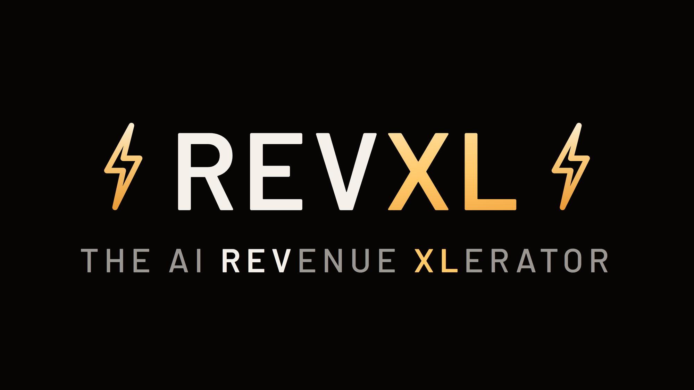

# revxl-marketplace



> A curated catalog of Claude superengines from [REVXL](https://engineforimpact.com). Opinionated, multi-skill plugins built for real coaching businesses.

[](https://github.com/joeoliveimpact/revxl-marketplace/actions/workflows/validate-plugins.yml)
[](LICENSE)

---

## What's a "superengine"?

A **superengine** is a multi-skill plugin built around a single domain. One install gives you all the skills, agents, and patterns you need to operate that domain end-to-end. No piecing together loose skills, no figuring out the right combinations.

Each superengine is opinionated about audience, tone, and workflow, so it works out of the box without configuration.

> **Moved:** `plugin-doctor` (fixes stalled plugin updates) lives in its own repo: [joeoliveimpact/plugin-doctor](https://github.com/joeoliveimpact/plugin-doctor).

---

## The catalog

16 plugins. Versions are current as of catalog `0.1.46`.

### 📣 Marketing & Content

| Plugin | Version | What it does |
|---|---|---|
| [email-sequence-superengine](plugins/email-sequence-superengine/) | 0.2.1 | Email nurture engine for high-ticket coaches. 8 sequence generators (pre-call, launch, warm, no-show, follow-up, winback, onboarding) in your voice, with story banks and GHL push. 13 skills. |
| [meta-ads-superengine](plugins/meta-ads-superengine/) | 0.3.0 | Full Meta-ads coaching journey: strategy, breakeven math, creative, launch runbook, daily ops, competitor pulse. 27 skills. **Proprietary license.** |
| [carousel-superengine](plugins/carousel-superengine/) | 0.4.1 | Voice-matched IG/LinkedIn carousel engine: create, render to finished slides, review, teardown competitor decks. 10 skills. |
| [shortform-superengine](plugins/shortform-superengine/) | 0.3.2 | Short-form reel scripting with enforced craft screens, competitor pulse, and creator strategy harvesting. 7 skills. |
| [lead-magnet-superengine](plugins/lead-magnet-superengine/) | 0.1.1 | Builds lead magnets three ways: from scratch, from a source, from your existing content. 6 skills + 1 agent. |
| [profile-optimization-superengine](plugins/profile-optimization-superengine/) | 0.1.0 | Social-profile optimization (bio, pinned content, CTA structure) for coach acquisition. 6 skills. |
| [focus-group-superengine](plugins/focus-group-superengine/) | 0.1.1 | Synthetic persona-swarm testing for marketing assets before you publish them. 2 skills. |
| [socialcrawl-superengine](plugins/socialcrawl-superengine/) | 0.2.0 | Social research plays on the SocialCrawl API: competitor content, trends, engagement. 3 skills. |

### 🤝 Sales & Client Ops

| Plugin | Version | What it does |
|---|---|---|
| [sales-call-blueprint-superengine](plugins/sales-call-blueprint-superengine/) | 0.1.2 | Turns pre-call DM threads and transcripts into customized sales-call blueprints (triage or strategy). 5 skills + 1 agent. |
| [ghl-coach-superengine](plugins/ghl-coach-superengine/) | 0.1.1 | Done-with-you GoHighLevel toolkit: MCP install, tags, pipelines, automations, coach-assistant agent. 8 skills + 2 agents. Requires [GoHighLevel-MCP](https://github.com/mastanley13/GoHighLevel-MCP). |
| [gokollab-community-superengine](plugins/gokollab-community-superengine/) | 0.1.2 | Community-management engine: member onboarding, 1-on-1 call history, Fathom-powered deep posts. 6 skills. |
| [offer-architect](plugins/offer-architect/) | 0.2.2 | Build market-validated offers Hormozi-style: intake, market research, value stack, pricing matrix, launch gate audit. 10 skills + 1 agent. |

### ⚙️ Productivity & Meta

| Plugin | Version | What it does |
|---|---|---|
| [promptception](plugins/promptception/) | 0.3.3 | Prompts that write prompts: brain-dump in, expert prompt out. Orchestrator Mode (tiered subagent crew + premortem), builders for `/goal`, `/loop`, `/schedule`, plus `/plan-builder` for jobs too big for one prompt. 7 skills + 5 agents. |
| [workspace-superengine](plugins/workspace-superengine/) | 0.10.0 | Workspace lifecycle: scaffold, session-start, session-closeout, checkpointing, cleanup. Plus `/update-everything`, the one command that updates every plugin, marketplace, and skill layer at once. Stops Claude from forgetting where you left off. 13 skills + 1 agent. |
| [notebooklm-superengine](plugins/notebooklm-superengine/) | 0.4.0 | Drive NotebookLM from Claude: build notebooks, curate sources, ask, studio outputs. 8 skills. |
| [course-crawler](plugins/course-crawler/) | 0.7.0 | Capture online course content into structured, searchable local knowledge. 5 skills. |

---

## Install

Pick the plugins you want. Skip what you don't.

### Claude Desktop (the chat app)

1. Open Claude Desktop
2. Click **Customize** in the left sidebar
3. Click **Skills** → **+** next to *"Personal plugins"*
4. Paste this GitHub path:
   ```
   joeoliveimpact/revxl-marketplace
   ```
5. Click **Sync**, then **Install** on the plugins you want

### Claude Code (developer tool)

```
/plugin marketplace add joeoliveimpact/revxl-marketplace
/plugin install <plugin-name>@revxl-marketplace
```

Or edit `~/.claude/settings.json` directly. See [docs/install-troubleshooting.md](docs/install-troubleshooting.md).

---

## Updates (read this, it is not automatic by default)

Three facts that save you a support message:

1. **Auto-update is OFF by default** for third-party marketplaces like this one. Turn it on once: `/plugin` → **Marketplaces** → `revxl-marketplace` → **Enable auto-update**. Without it, you update manually:
   ```
   /plugin marketplace update revxl-marketplace
   /plugin update <plugin-name>@revxl-marketplace
   ```
2. **Claude Desktop caches the catalog in memory.** After an update, fully quit the app (system tray → Quit, not just closing the window) and relaunch. Otherwise you keep seeing the old version even though the new one is on disk.
3. **Still stuck on an old version?** That's a known pinning stall. Install [plugin-doctor](https://github.com/joeoliveimpact/plugin-doctor) and run `/plugin-doctor`. It diagnoses and fixes it.

New versions ship by version-number bump. If your installed version matches the [catalog](#the-catalog) above, you're current.

---

## Repository structure

```
revxl-marketplace/
├── .claude-plugin/
│   └── marketplace.json          ← the catalog (single source of truth for what's published)
├── .github/workflows/
│   └── validate-plugins.yml      ← CI: validates structure + catalog on every push
├── plugins/
│   └── <plugin-name>/            ← each plugin fully self-contained
│       ├── .claude-plugin/plugin.json
│       ├── skills/  agents/  hooks/
│       └── README.md  CHANGELOG.md  LICENSE
├── docs/                         ← architecture, conventions, troubleshooting
├── scripts/validate.py           ← local CI mirror (run before pushing)
├── README.md  CHANGELOG.md  CONTRIBUTING.md  LICENSE
```

A `plugins/` folder that is **not** in `marketplace.json` is work-in-progress and not installable. The catalog decides what's published.

---

## For developers

- [docs/architecture.md](docs/architecture.md) — how the marketplace is structured and why
- [docs/plugin-conventions.md](docs/plugin-conventions.md) — naming, frontmatter, tone rules
- [docs/creating-plugins.md](docs/creating-plugins.md) — contributor guide
- [CONTRIBUTING.md](CONTRIBUTING.md) — PR process; **every release PR must update this README's catalog table and the root CHANGELOG** (CI enforces catalog/README parity)

---

## License

The marketplace repo is MIT ([LICENSE](LICENSE)). Each plugin carries its **own** license: all MIT except `meta-ads-superengine` (proprietary; view-only source).

## Author

[Joe Olive](mailto:joe@engineforimpact.com) — [REVXL](https://engineforimpact.com)

## Issues / Requests

[Open a GitHub issue](https://github.com/joeoliveimpact/revxl-marketplace/issues) — bug reports, feature requests, "this should also do X" all welcome.
